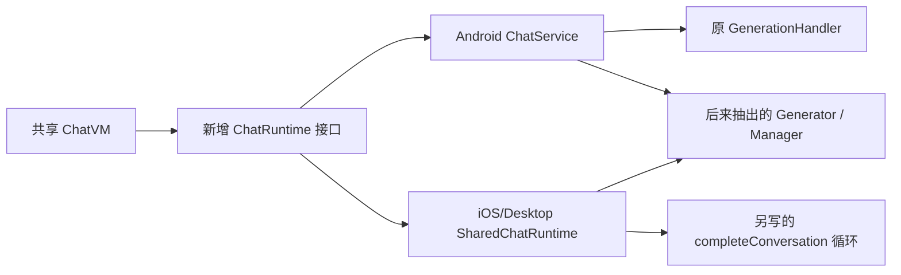

# 对照 2.4.5 的 CMP 最小改动审计

审计日期：2026-09-09。基线为 tag `2.4.5`（`5f39f1c1d2298cd88ce908a5a0858d4830885a6b`），当前为 `feature/cmp-migrate` 的 `006ee55dbbcd0366b490c774b7c8e195ba7043bd`。
分析的是当前保留下来的代码，不把已撤回的中间实现算作现存问题。工作区两项既有 Xcode 配置修改不计入本次抽取统计。

## 结论与数量

**当前迁移明显超出了“原文件/方法迁入 common，只处理不兼容点”的范围。主要问题是建立了并行的业务实现和中间业务接口，随后继续抽方法来补齐这些新实现。**

确认 **17 组额外抽取或分层**，涉及 **36 个核心生产文件**；其中 **32 个文件在基线没有同名文件，共 3,213 行**。另有 **1 组额外启动演示脚手架**、**10 组“必要适配与额外设计混在一起”的实现**。17 组是按下面明确列出的职责计数的审计结果，不是类名扫描数量，也不是所有不必要改动的理论上限。

3,213 行含原方法搬出的代码、import、注释和空行，**不等于可删除 3,213 行**。真正收敛时应把原业务放回单一共享实现，删除包装和重复部分；本次不编造“精确可节省行数”或历史工时。

| 清点项 | 数量 | 含义 |
|---|---:|---|
| 基线生产 Kotlin 文件 | 542 | 所有模块 `src` 下的非测试 `.kt` |
| 当前生产 Kotlin 文件 | 975 | 净增 433；不等于多做 433 项业务 |
| 有同名基线候选的当前文件 | 523 | 包括原路径、移动与少量同名歧义；160 个候选 blob 完全相同 |
| 没有同名基线文件的当前文件 | 452 | 新文件名，不自动等于新逻辑 |
| 其中 `hugeicons` 新文件名 | 144 | 10,661 行资产/依赖源码，排除出业务抽取数量 |
| 排除图标后的新文件名 | 308 | 18,874 行；已全部归入下表的责任组 |
| 其中 commonMain 新文件名 | 146 | 11,123 行；不少是原有方法/类型拆文件 |
| 其中平台或原 Android app 新文件名 | 162 | 7,751 行；不少是各端 actual/宿主 |
| 测试源码文件 | 62 → 86 | 只表示文件数，不表示测试次数、覆盖率或验证成功 |

308 个非图标新文件名的分类如下。分类针对抽取方向和职责边界，不能代替行为验证。

| 分类 | 责任组 | 新文件名数 | 当前行数 |
|---|---:|---:|---:|
| 明确超出最小迁移的抽取/分层 E01–E17 | 17 | 32 | 3,213 |
| 必要部分与额外设计混合 B01–B10 | 10 | 36 | 4,465 |
| 平台适配、换库工具、原符号拆出，方向合理 | 21 | 232 | 10,774 |
| 小策略/界面接线，可选轻量抽取 | 1 | 5 | 342 |
| 独立 ZIP 路径修复 | 1 | 3 | 80 |
| 合计 | 50 | 308 | 18,874 |

额外脚手架 X01 是第 51 个责任组。它恰好叫 `RikkaHubApp.kt`，但原来是 Android `Application` 类，新增的是 Compose 根函数，故不在“没有同名文件”的 308 个文件中。这也说明不能只凭同名或 Git rename 分数判断是否原样迁移。

完整可筛选附件：

- [51 组判断清单](/Users/liuzhenhui/AndroidStudioProjects/rikkahub/docs/references/cmp-minimal-change-findings-2.4.5.csv)：来源、当前文件、理由、技术处理类别及建议。
- [975 个生产文件对照清单](/Users/liuzhenhui/AndroidStudioProjects/rikkahub/docs/references/cmp-minimal-change-inventory-2.4.5.csv)：同名候选、blob 是否一致、规范化差异、审计组和覆盖说明。

## 判断标准

先检查原方法使用的具体符号和依赖，再选择处理方式；不以 `Shared`、`Runtime`、`interface` 这些名字直接下结论。

| 原代码遇到的问题 | 最小处理 | 不应随之引入的东西 |
|---|---|---|
| 纯 Kotlin/已支持 KMP 的库 | 原文件、原方法直接移动，保持调用链 | 新 Repository、Runtime、Gateway、Policy 或镜像 DTO |
| OkHttp、Retrofit、Jsoup、旧 QuickJS 等库不可用 | 换兼容库，保留参数、流式/异常/取消契约 | 因换库而重写整个生成或业务保存流程 |
| 文件根目录、Bitmap/EXIF、RSA、系统权限、通知、Intent 等真实平台 API | 窄 `expect/actual` 函数、工厂或确有必要的接口 | 把整套 ChatService/VM 变成按平台各写一遍的业务实现 |
| 多处复用的时间格式化、编码、日志、文件复制 | 可以抽 util；本地化格式必要时 actual | 为一条普通业务判断新建可替换策略体系 |
| 仅为方便测试 | 优先测原入口，使用已有 Clock、Ktor MockEngine、DAO 测试能力 | 把“便于测试”写成“迁移到 common 的硬性要求” |
| 原功能缺陷或新平台暂未实现 | 独立记录修复或能力缺口 | 把功能补齐、状态机、额外校验包装为原样迁移 |

`expect/actual` 与接口不是互斥选项：重点是边界落在真实平台操作，而不是落在整段业务。当前 FileEncoder 的几个 expect 函数、HighlightLock、SharedUiFormatter 都比“再写一套 ChatRuntime”更接近这里的要求。

官方文档也允许共享 DAO/entity，仅把数据库构建所需的平台路径留在平台源集；因此不能由“使用数据库”推出“必须再加一层查询业务接口”。见 [Room KMP 配置](https://developer.android.com/kotlin/multiplatform/room) 和 [expect/actual 文档](https://kotlinlang.org/docs/multiplatform/multiplatform-expect-actual.html)。

## 17 组明确应收敛的额外抽取

“应收敛”针对列出的包装、重复实现或职责移动，不表示可以直接删除整个文件。E12–E15 就发生在仍然同名的原文件内部，单看新增文件列表会漏掉。

| ID / 当前定位 | 2.4.5 来源 | 多做了什么 / 判断依据 | 最小迁移应如何处理 |
|---|---|---|---|
| E01 第二套聊天运行时 [SharedChatRuntime.kt](/Users/liuzhenhui/AndroidStudioProjects/rikkahub/composeApp/src/commonMain/kotlin/me/rerere/rikkahub/service/SharedChatRuntime.kt:88) | `ChatService.kt + data/ai/GenerationHandler.kt` | 接口覆盖整套业务；非 Android 重新实现会话、分支、生成循环，未直接迁移原类。 | 按原 ChatService/GenerationHandler 收敛成一套 common 业务，只适配末端文件、资源、系统集成。 |
| E02 第二套图片生成运行时 [ImageGenerationRuntime.kt](/Users/liuzhenhui/AndroidStudioProjects/rikkahub/composeApp/src/commonMain/kotlin/me/rerere/rikkahub/service/ImageGenerationRuntime.kt:22) | `ui/pages/imggen/ImgGenVM.kt + GenMediaRepository.kt` | 把 VM 的请求、分页、落盘拆成整套 runtime，并维护 Android/Shared 两份流程。 | 保留 ImgGenVM 业务；文件与图像编解码使用 FileKit 或窄平台实现。 |
| E03 翻译运行时转发层 [TranslationRuntime.kt](/Users/liuzhenhui/AndroidStudioProjects/rikkahub/composeApp/src/commonMain/kotlin/me/rerere/rikkahub/service/TranslationRuntime.kt:8) | `TranslatorVM.kt + GenerationHandler.translateText` | SettingsStore 与翻译参数均可共用，三个 runtime 文件继续转发设置和同一个翻译主体。 | VM 保留直接 SettingsStore/共享原翻译方法依赖，Locale 在最窄处转换。 |
| E04 MCP 业务接口和资源镜像模型 [McpRuntime.kt](/Users/liuzhenhui/AndroidStudioProjects/rikkahub/composeApp/src/commonMain/kotlin/me/rerere/rikkahub/data/ai/mcp/McpRuntime.kt:46) | `McpManager.kt + McpOAuthCoordinator.kt + MCP SDK resource types` | McpManager/Coordinator 及 SDK 已进入 common，仍在外层镜像整套业务 API 与 SDK DTO。 | 保留 OAuthCallbackSession、外部 URI、图片落盘边界；共同代码直接依赖原 Manager。 |
| E05 统计 Repository/Queries 分层 [StatsRepository.kt](/Users/liuzhenhui/AndroidStudioProjects/rikkahub/composeApp/src/commonMain/kotlin/me/rerere/rikkahub/data/repository/StatsRepository.kt:18) | `ui/pages/stats/StatsVM.kt::loadStats` | StatsVM 原本直接调用 DAO；新增 StatsRepository、StatsQueries、RoomStatsQueries 三层。 | 迁移原 VM 和日期 API；DAO 已在 common，继续原直接调用。 |
| E06 备份业务仓库与设置 Gateway [BackupRepository.kt](/Users/liuzhenhui/AndroidStudioProjects/rikkahub/composeApp/src/commonMain/kotlin/me/rerere/rikkahub/data/repository/BackupRepository.kt:12) | `ui/pages/backup/BackupVM.kt` | 新增 BackupRepository、BackupSettingsGateway、SettingsStoreBackupSettingsGateway；包裹已有 common SettingsStore。 | 保留原 VM 的设置、列表、备份后更新时间流程，撤掉纯转发设置 Gateway。 |
| E07 并行备份同步和归档编排 [BackupTransport.kt](/Users/liuzhenhui/AndroidStudioProjects/rikkahub/composeApp/src/commonMain/kotlin/me/rerere/rikkahub/data/sync/BackupTransport.kt) | `data/sync/S3Sync.kt + data/sync/webdav/WebDavSync.kt` | 旧 Android Sync 留存，同时新增 Shared Sync/Archive 路径，复制配置、归档、恢复和清理流程。 | 迁移原 Sync；Ktor、文件系统和数据库文件路径做适配；保留确有复用的 ZIP I/O 工具。 |
| E08 本地备份导入业务服务 [BackupLocalFileService.kt](/Users/liuzhenhui/AndroidStudioProjects/rikkahub/composeApp/src/commonMain/kotlin/me/rerere/rikkahub/data/repository/BackupLocalFileService.kt) | `BackupVM.kt::restoreFromChatBox/restoreFromCherryStudio/exportToFile` | 以 LocalFileService 为名复制导入去重、助手设置更新和备份时间等业务，不只隔离 I/O。 | 原导入业务保留单份，平台边界只处理文件读写和选取。 |
| E09 技能存储并行实现 [SkillStore.kt](/Users/liuzhenhui/AndroidStudioProjects/rikkahub/composeApp/src/commonMain/kotlin/me/rerere/rikkahub/data/files/SkillStore.kt) | `data/files/SkillManager.kt + SkillPaths.kt + SkillMetadata.kt` | 原 SkillManager 仍留 Android；FileKitSkillStore 另写解析、保存、删除及设置清理，新增 Summary/File DTO。 | 保留 SkillManager 方法、原路径规则及原子保存算法，仅替换 File/Context；原 staging 行为不是本次新增。 |
| E10 提示词预览运行时 [AssistantPromptPreviewRuntime.kt](/Users/liuzhenhui/AndroidStudioProjects/rikkahub/composeApp/src/commonMain/kotlin/me/rerere/rikkahub/ui/pages/assistant/detail/AssistantPromptPreviewRuntime.kt) | `AssistantPromptPage.kt 调用 TemplateTransformer` | Android 走 TemplateTransformer；Common 另造 Korte renderer 和 time/date 上下文，已有语义分叉。 | 两端直接调用已共享的 TemplateTransformer，保留原预览参数。 |
| E11 助手技能目录接口 [AssistantSkillCatalog.kt](/Users/liuzhenhui/AndroidStudioProjects/rikkahub/composeApp/src/commonMain/kotlin/me/rerere/rikkahub/ui/pages/assistant/AssistantSkillCatalog.kt) | `AssistantDetailVM.kt 对 SkillManager 的访问` | 又增加一套 listSkills 与 AssistantSkillMetadata，重复包装 SkillStore/SkillManager。 | 随 SkillManager 迁移一起移除中间 DTO/接口，保持原数据与选择 key 语义。 |
| E12 会话实体映射类 [ConversationRepository.kt](/Users/liuzhenhui/AndroidStudioProjects/rikkahub/composeApp/src/commonMain/kotlin/me/rerere/rikkahub/data/repository/ConversationRepository.kt:456) | `同名 ConversationRepository.kt 内原转换方法` | 仅替换 Instant API 即可，却增加 ConversationEntityMapper 再让原方法转发。 | 映射方法留在原位置；文件删除与 Android 数据库异常的窄边界另行保留。 |
| E13 文件夹映射类和 DAO 回调 [FolderRepository.kt](/Users/liuzhenhui/AndroidStudioProjects/rikkahub/composeApp/src/commonMain/kotlin/me/rerere/rikkahub/data/repository/FolderRepository.kt:47) | `同名 FolderRepository.kt 私有扩展与 createFolder` | 新增 FolderPersistenceMapper，并把已可共享的 ConversationDAO 改成 clearConversationFolder 回调。 | 原私有扩展/DAO 依赖保留，改 Instant 取得与转换 API 即可。 |
| E14 请求日志专用测试接口 [RequestLoggingInterceptor.kt](/Users/liuzhenhui/AndroidStudioProjects/rikkahub/app/src/main/java/me/rerere/rikkahub/data/ai/RequestLoggingInterceptor.kt:10) | `同名 Android RequestLoggingInterceptor.kt` | 新增 RequestLogSink、RequestTimeSource、RequestTimeMark 及实现；文件仍留 Android，跨平台插件又独立实现。 | 时间使用 kotlin.time；避免为单一拦截器维护额外时钟/日志接口，保留实际所需 Ktor 插件。 |
| E15 Vertex token HTTP 二次封装 [ServiceAccountTokenProvider.kt](/Users/liuzhenhui/AndroidStudioProjects/rikkahub/ai/src/commonMain/kotlin/me/rerere/ai/provider/providers/vertex/ServiceAccountTokenProvider.kt:28) | `同名 ServiceAccountTokenProvider.kt::getAccessToken` | 除必要 RSA 平台适配外，新增 ServiceAccountTokenTransport/HttpResponse/KtorServiceAccountTokenTransport 包一条 POST。 | 原 Provider 内直接使用 Ktor HttpClient；测试可使用现有 MockEngine；RSA 签名边界保留。 |
| E16 OAuth 刷新业务 Policy [McpTokenPolicy.kt](/Users/liuzhenhui/AndroidStudioProjects/rikkahub/composeApp/src/commonMain/kotlin/me/rerere/rikkahub/data/ai/mcp/McpTokenPolicy.kt:9) | `McpOAuthCoordinator.kt::needsRefresh/computeExpiry` | 把普通 token 过期判断和时间计算独立为业务 Policy，Clock 替换本身不要求拆类。 | 判断留在原 Coordinator；注入已有 Clock 类型即可，无需新增业务策略层。 |
| E17 Web 服务生命周期二次分层 [WebServerController.kt](/Users/liuzhenhui/AndroidStudioProjects/rikkahub/web/src/commonMain/kotlin/me/rerere/rikkahub/web/WebServerController.kt:61) | `web/WebServerManager.kt + web module Server.kt` | Host 隔离有必要；另增 Controller 状态机/Mutex/配置校验，再由 Runtime 映射第二套 ManagerState。 | 保留真实 engine/前台服务/NSD 边界，尽量沿用原 Manager 与状态，不为迁移新增生命周期规则。 |

E01、E02、E07、E08、E09 的优先级最高，因为它们增加了第二套业务实现。E05/E06/E10/E11/E04 是可清晰识别的中间业务层。E12–E16 属于较小的额外抽取，风险和成本应与前者区分；不建议为了先减少类数量而优先大动这些低收益部分。

额外脚手架 X01：[RikkaHubApp.kt](/Users/liuzhenhui/AndroidStudioProjects/rikkahub/composeApp/src/commonMain/kotlin/me/rerere/rikkahub/shared/RikkaHubApp.kt:49) 增加了 Status/Capabilities 演示页面和底栏/侧栏。正式调用传入 `productContent` 时直接返回产品内容。各平台正式入口应保留，演示 UI 不是迁移原产品业务的必要组成。

## SharedChatRuntime：问题在哪里

### 来源与现状

`ChatRuntime` 出现在 `e514b8ba3`（会话状态与列表骨架），`SharedChatRuntime` 出现在 `57b8df0e2`（非 Android 聊天运行时）。这些是文件首次加入 Git 的提交，不用于推断具体作者、模型或当时是否另有口头授权。

基线 `ChatService` 是普通 Kotlin 类，构造参数持有 `Application`，**并没有继承 Android Service**；`GenerationHandler` 同样是普通类。`Application/Context`、文件和 workspace 系统集成确实需要处理，但并不要求另造一套聊天业务。当前 Android 仍走 [ChatService.kt](/Users/liuzhenhui/AndroidStudioProjects/rikkahub/app/src/main/java/me/rerere/rikkahub/service/ChatService.kt:100) 和 [GenerationHandler.kt](/Users/liuzhenhui/AndroidStudioProjects/rikkahub/app/src/main/java/me/rerere/rikkahub/data/ai/GenerationHandler.kt:60)，iOS/Desktop 走 [SharedChatRuntime.kt](/Users/liuzhenhui/AndroidStudioProjects/rikkahub/composeApp/src/commonMain/kotlin/me/rerere/rikkahub/service/SharedChatRuntime.kt:88)。

### 已确认的代码行为分叉

以下均直接核对了 tag 中的原方法和当前调用链；是源码结论，不冒充这轮 GUI 实测结果。原始行号对应 `git show 2.4.5:路径`。

| 行为 | 2.4.5 原逻辑 | 当前 SharedChatRuntime | 影响 |
|---|---|---|---|
| 会话引用与回收 | `ChatService` 通过 `ConversationSession.acquire/release` 和 idle 回调管理会话 | `addConversationReference` 仅建状态，[removeConversationReference](/Users/liuzhenhui/AndroidStudioProjects/rikkahub/composeApp/src/commonMain/kotlin/me/rerere/rikkahub/service/SharedChatRuntime.kt:189) 是空操作；另有多张 Map | 原会话生命周期没有迁过去；即使 ConversationSession 已在 common，也未被它使用 |
| 编辑消息 | `ChatService:1061`：空输入跳过、正则预处理、向原节点追加一个新消息分支并选择它 | [editMessage](/Users/liuzhenhui/AndroidStudioProjects/rikkahub/composeApp/src/commonMain/kotlin/me/rerere/rikkahub/service/SharedChatRuntime.kt:268) 直接替换匹配消息的 parts | 覆盖旧版本，未保留原编辑分支；空输入和编辑预处理也不同 |
| 重新生成助手消息 | `ChatService:362`：按 `messageRange` 请求；原节点交给 `updateCurrentMessages` 处理，未预先删除目标节点 | [regenerateAtMessage](/Users/liuzhenhui/AndroidStudioProjects/rikkahub/composeApp/src/commonMain/kotlin/me/rerere/rikkahub/service/SharedChatRuntime.kt:339) 先保存 `take(nodeIndex)`，丢掉目标节点及后续节点；`regenerateAssistantMsg=false` 也先截断 | 原助手分支保留方式变了，这是产品行为变更 |
| 停止生成 | `ChatService:1256`：cancel → join → finishInterruptedPendingTools | [stopGeneration](/Users/liuzhenhui/AndroidStudioProjects/rikkahub/composeApp/src/commonMain/kotlin/me/rerere/rikkahub/service/SharedChatRuntime.kt:402) 只有 cancel | 停止完成与待处理工具的收尾不等价 |
| 新消息前清理 | 原 `sendMessage` 会收尾被打断工具，生成前检查无效工具消息 | Shared 发送/生成流程未调用已迁出的对应清理方法 | “helper 已进入 common”不等于调用链已共用 |
| 保存会话 | `ChatService:979`：新会话标题和消息都为空时跳过；先更新内存，再 insert/update | [saveConversation](/Users/liuzhenhui/AndroidStudioProjects/rikkahub/composeApp/src/commonMain/kotlin/me/rerere/rikkahub/service/SharedChatRuntime.kt:406) 无上述空会话跳过，强制 `newConversation=false`，先 DB 后内存 | 保存条件、标记和出错时的内存状态不同 |
| Fork | `ChatService:1095`：选择原字段新建 Conversation，复制本地附件再保存 | [forkConversationAtMessage](/Users/liuzhenhui/AndroidStudioProjects/rikkahub/composeApp/src/commonMain/kotlin/me/rerere/rikkahub/service/SharedChatRuntime.kt:299) 对整个 source.copy，追加 `(Fork)` 标题，只更换 node id，附件 URL 不复制 | 标题、继承字段、文件归属及缺失消息异常不同 |
| 生成循环上限 | `GenerationHandler:71` 原参数 `maxSteps=256` | `MAX_GENERATION_STEPS=32`，生成和工具处理会分别占循环；耗尽时额外 `check(completed)` | 不是数值的等价替换，连续工具调用终止条件变化 |
| 流式输出转换 | `GenerationHandler:132` 每次流更新执行 output transforms/visualTransforms；完成阶段再执行 finish | Shared 在收集 chunk 时直接更新消息，流结束后才做 visualTransforms/onGenerationFinish | 原实时转换与完成字段接线并未完整迁移；不能仅凭最终响应正确判等价 |
| 任务与事件 | 原 session job、无额外缓冲的完成流、原错误/结束事件路径 | 新增 `generationVersions`，完成流 `extraBufferCapacity=1`，另一套 startGeneration 清理路径 | 引入新的并发及事件处理语义，不能归为换库 |
| 工具结果文本 | 原 Handler 保留拒绝原因回退和错误类型/堆栈格式 | 新 executeTool 改成更短的拒绝/错误文本 | 模型收到的工具输出也变了；并非只改平台 API |

这些差异已经足以判定 E01 超出最小迁移范围，不需要先判断哪套实现“更好”。目标应是保持原行为。

### 后续抽取为何越做越多

当前 `ConversationTitleGenerator`、`ConversationSuggestionGenerator`、`ConversationCompressor`、`MessageTranslationManager`、`TextTranslationGenerator` 共 **5 个新类文件、415 行**。它们的主体比早期版本更接近原代码；不把原有空响应、异常或取消规则重新算作新问题。

但它们承接了一系列 `getSettings/getConversation/updateConversation/saveConversation/onError` 回调，主要是为了服务两个不同 runtime。`SettingsStore`、Repository 和大部分业务明明已可共用，却仍需每个 runtime 装配一次。它们是前序分叉造成的后续成本。

其中 `TextTranslationGenerator` 同时服务翻译页和聊天翻译，确有复用价值；问题是原 `GenerationHandler.translateText` 本来就承担共用入口，不必连带维持两层 Runtime。不能把这 5 个文件简单认定为无价值，也不能把其存在自动称为 KMP 必需。

最近迁出的 `backgroundTextGenerationParams`、输入预处理、消息删除计算、无效消息清理、工具收尾以及 `ConversationSession`，多为原方法/原类型搬移。应保留这些工作中的原方法体；统一原服务后可自然归回原职责，没必要再新增更多 Generator 或接口。

## 10 组混合情况：保留必要部分，收窄额外部分

| ID / 定位 | 为什么有必要 | 额外成本与处理意见 |
|---|---|---|
| B01 聊天后续方法抽取 [ConversationTitleGenerator.kt](/Users/liuzhenhui/AndroidStudioProjects/rikkahub/composeApp/src/commonMain/kotlin/me/rerere/rikkahub/service/ConversationTitleGenerator.kt) | 主体大体保留原行为；但因两个 runtime 共存而增加 Generator/Manager 与大量回调，是前序分叉的后续成本。 | 当前不盲删；原 ChatService/GenerationHandler 统一时将主体放回原职责，再删除无用包装。 |
| B02 聊天页面大范围平台容器 [ChatPagePlatformContent.kt](/Users/liuzhenhui/AndroidStudioProjects/rikkahub/composeApp/src/commonMain/kotlin/me/rerere/rikkahub/ui/pages/chat/ChatPagePlatformContent.kt) | IME、音量键、截图和系统选择器需适配，但整块错误、加载、附件及预览 UI 也放入平台接口和 fallback。 | 共用原 Compose UI，仅在系统动作及不能共享的组件上留 expect/actual 或原参数 slot。 |
| B03 模板引擎兼容层与多余转发 [MessageTemplateRenderer.kt](/Users/liuzhenhui/AndroidStudioProjects/rikkahub/composeApp/src/commonMain/kotlin/me/rerere/rikkahub/shared/template/MessageTemplateRenderer.kt:1) | Pebble 换 Korte 与过滤器兼容合理；Default→Korte 转发、ContextFactory 及多个接口并非全部必要。 | 保留最小引擎语义兼容层与原缓存；普通上下文构造可留 Transformer 内。 |
| B04 通用并发 Map 的自研实现 [AtomicSnapshotMap.kt](/Users/liuzhenhui/AndroidStudioProjects/rikkahub/common/src/commonMain/kotlin/me/rerere/common/concurrent/AtomicSnapshotMap.kt:13) | 多个调用点使用，属于可抽取 util；但 Ready/Pending/CAS/自旋等待是新并发实现，并非简单替换依赖。 | 优先保留原并发语义；评估窄 expect/actual 容器是否减少成本；已修复 ANR 不应直接回滚。 |
| B05 TTS 调度数据结构抽取 [TtsSchedulingStore.kt](/Users/liuzhenhui/AndroidStudioProjects/rikkahub/speech/src/commonMain/kotlin/me/rerere/tts/controller/TtsSchedulingStore.kt:9) | JDK 容器需替换；新增三泛型业务 Store、Pending/CAS/自旋，并非迁移调度主体所必需。 | 业务调度保留原 TtsController；容器适配单独解决并保持取消与队列语义。 |
| B06 手写 ZIP 容器 [ZipArchive.kt](/Users/liuzhenhui/AndroidStudioProjects/rikkahub/common/src/commonMain/kotlin/me/rerere/common/archive/ZipArchive.kt:1) | ZIP 平台边界合理；共同容器/CRC32/raw-deflate 编排是新实现，当前显式不支持 ZIP64。 | 保留小归档 API；优先沿用各平台成熟 ZIP 实现或经验证的 KMP 库，不把手写 ZIP 视为必选。 |
| B07 通知 Policy/Coordinator/Presenter [ChatNotification.kt](/Users/liuzhenhui/AndroidStudioProjects/rikkahub/composeApp/src/commonMain/kotlin/me/rerere/rikkahub/platform/ChatNotification.kt) | 系统通知与前台事件适配必要，原事件/节流主体可以共享；另拆 Policy/Coordinator 不是必要条件。 | 保留原 Manager 业务与平台 Presenter/前台事件，减少同层策略类。 |
| B08 非 Android 产品入口与整套 DI [SharedProductApp.kt](/Users/liuzhenhui/AndroidStudioProjects/rikkahub/composeApp/src/commonMain/kotlin/me/rerere/rikkahub/shared/SharedProductApp.kt:78) | iOS/Desktop 入口与平台实例注入必要；重新维护整套业务绑定和二十余入口参数是分叉成本。 | 共用原业务 Koin module，平台侧只供给 engine、路径及系统实例；保留各端实际生命周期。 |
| B09 文件工具和新的目录布局 [PlatformFileStore.kt](/Users/liuzhenhui/AndroidStudioProjects/rikkahub/composeApp/src/commonMain/kotlin/me/rerere/rikkahub/platform/PlatformFileStore.kt:16) | 多处共用的复制/写文件 util 合理；新 platform-files/attachments 路径与旧备份/删除约定尚未对齐。 | 保留文件 util/平台 I/O，沿用原目录及失败约定；统一备份、fork 与清理。 |
| B10 JavaScript executor 与 HTTP 适配 [JavaScriptExecutor.kt](/Users/liuzhenhui/AndroidStudioProjects/rikkahub/common/src/commonMain/kotlin/me/rerere/common/js/JavaScriptExecutor.kt) | 换 QuickJS-KT、保留同步 fetch/超时/结果格式需要适配；单一包装或兼容执行器合理，测试 Observer 和多层 DTO/Transport 可精简。 | 保留脚本兼容语义；按实际库差异限定层数，不把整个 executor 判为多余。 |

这里有三个值得优先验证的具体连接问题：

1. **文件路径与备份脱节。** `PlatformFileStore` 默认写入 `platform-files/attachments` 等新目录，`SharedChatAttachmentStore` 使用它；但 [BackupArchiveService](/Users/liuzhenhui/AndroidStudioProjects/rikkahub/composeApp/src/commonMain/kotlin/me/rerere/rikkahub/data/sync/BackupArchiveService.kt) 的文件打包/恢复范围是 `upload`、`skills`、`fonts`。从代码路径可确认，新增的 `platform-files` 附件目录不在该归档范围内。文件 util 本身可以保留，目录/归档约定需要恢复一致。
2. **删除接口存在，实际为空。** [SharedProductModule](/Users/liuzhenhui/AndroidStudioProjects/rikkahub/composeApp/src/commonMain/kotlin/me/rerere/rikkahub/shared/SharedProductModule.kt:158) 将 `ConversationFileStore` 绑定为 `ConversationFileStore { }`。当前非 Android Repository 删除会话不会经此接口清理附件。抽出了边界，未等于接通原效果。
3. **提示词预览与实际渲染不一致。** Android 的预览走原 `TemplateTransformer`，common 预览重新构造上下文：`createdAt.time/date.toString()`；已共享的 Transformer 则使用 `MessageTemplateContextFactory` 的本地化时间/日期。这条 runtime 无须存在，且当前已经造成同一模板的不同输入值。

`AtomicSnapshotMap` 属于多个地方使用的非业务 util，不能一概否定抽取；但当前实现包含 Pending 状态和无让步的自旋等待。此前 session 自锁修复与它的重入调用相关。应审查所选并发实现是否真是最小成本，同时保留已确认的修复，不能为回到 tag 而把 ANR 带回来。

手写 ZIP 同样不能混为“正常换一个库”：当前 `CommonZipArchive` 自己负责 ZIP 头、目录及校验，[条目数限制](/Users/liuzhenhui/AndroidStudioProjects/rikkahub/common/src/commonMain/kotlin/me/rerere/common/archive/CommonZipArchive.kt:214) 明确拒绝 ZIP64 条目数量。这是新增兼容实现和限制，应独立验证、说明替代路线；不能仅因外层是 expect/actual 就判定整体最小。

## 合理或可接受的部分

下面按责任归类说明，完整文件映射见 CSV。保留方向合理，不代表这轮已验证各端每一项运行行为。

| 组 | 部分 | 判断与边界 |
|---|---|---|
| R01 | 网络换库与多调用点协议工具 [OpenAIHttp.kt](/Users/liuzhenhui/AndroidStudioProjects/rikkahub/ai/src/commonMain/kotlin/me/rerere/ai/provider/providers/openai/OpenAIHttp.kt) | Ktor+平台 engine 是合理换库；复用的请求/编码函数及回调到协程兼容层不等于新业务架构。 保留请求与取消契约；不要在此基础上增加业务 Repository/UseCase。 |
| R02 | 附件平台编码 [FileEncoder.kt](/Users/liuzhenhui/AndroidStudioProjects/rikkahub/ai/src/commonMain/kotlin/me/rerere/ai/util/FileEncoder.kt) | common 保留同名入口，Bitmap/EXIF/本地文件读取移到 actual。 保留窄 expect 函数和原编码语义。 |
| R03 | 加密与安全随机平台实现 [Md5Digest.kt](/Users/liuzhenhui/AndroidStudioProjects/rikkahub/common/src/commonMain/kotlin/me/rerere/common/crypto/Md5Digest.kt) | 隔离真实平台密码学；上层签名与业务流程保持原有形状。 保留；不要手写密码算法替代成熟实现。 |
| R04 | 本地化时间和数值 util [CalendarDate.kt](/Users/liuzhenhui/AndroidStudioProjects/rikkahub/common/src/commonMain/kotlin/me/rerere/common/time/CalendarDate.kt) | 同一工具多处复用；计算用 Kotlin 时间，Locale 格式化使用 expect/actual。 保留原精度/格式/时区，普通 epoch 调用直接替换。 |
| R05 | Key 轮换持久化与锁 [PersistentKeyRoulette.kt](/Users/liuzhenhui/AndroidStudioProjects/rikkahub/ai/src/commonMain/kotlin/me/rerere/ai/util/PersistentKeyRoulette.kt) | 轮换算法原先存在；文件读写、缓存路径和同步锁需适配。 保留算法/缓存格式，只隔离 I/O/锁。 |
| R06 | 高亮同步锁 [HighlightLock.kt](/Users/liuzhenhui/AndroidStudioProjects/rikkahub/highlight/src/commonMain/kotlin/me/rerere/highlight/core/HighlightLock.kt) | 窄 expect/actual 锁，未把高亮业务变成新 runtime。 可作为最小平台适配示例。 |
| R07 | 搜索反射替代 [SearchProviderRegistry.kt](/Users/liuzhenhui/AndroidStudioProjects/rikkahub/search/src/commonMain/kotlin/me/rerere/search/SearchProviderRegistry.kt) | 显式构造注册表替代 kotlin-reflect；locale 为真实平台差异。 保留原 provider 对应关系及默认值。 |
| R08 | 数据库/DataStore 构建及旧偏好适配 [SettingsDataStore.kt](/Users/liuzhenhui/AndroidStudioProjects/rikkahub/composeApp/src/commonMain/kotlin/me/rerere/rikkahub/data/datastore/SettingsDataStore.kt) | 数据库路径、Android SharedPreferences 和 SQLite 驱动/异常适配必要；不是整套业务仓库抽象。 保留旧 key/文件名/schema；Room3 升级是否必要另列，勿混同。 |
| R09 | 文档/OCR/图片等外部能力接缝 [DocumentTextExtractor.kt](/Users/liuzhenhui/AndroidStudioProjects/rikkahub/composeApp/src/commonMain/kotlin/me/rerere/rikkahub/data/ai/transformers/DocumentTextExtractor.kt) | 文档模块尚为 Android，图像编解码和缓存持久化需替库/平台实现；transformer 业务仍在同名文件。 UnsupportedDocumentTextExtractor 是能力未完成，不代表原文档功能已经跨端迁移。 |
| R10 | 系统操作窄适配 [PlatformBackHandler.kt](/Users/liuzhenhui/AndroidStudioProjects/rikkahub/composeApp/src/commonMain/kotlin/me/rerere/rikkahub/platform/PlatformBackHandler.kt) | 边界是具体系统动作，未重新实现业务。 保留。 |
| R11 | 系统 OAuth、监控、发现及浮窗 [OAuthCallbackSession.kt](/Users/liuzhenhui/AndroidStudioProjects/rikkahub/composeApp/src/commonMain/kotlin/me/rerere/rikkahub/platform/OAuthCallbackSession.kt) | 具体系统 SDK/外部回调需要各端实现；桌面监控后端选择属于实现选择。 保留 OS 接线；业务 OAuth Coordinator 不必另抽大接口。 |
| R12 | 二维码、图片与字体平台实现 [QrCode.kt](/Users/liuzhenhui/AndroidStudioProjects/rikkahub/composeApp/src/commonMain/kotlin/me/rerere/rikkahub/platform/QrCode.kt) | 多数是实际平台适配；Runtime 名字不能独立作为过度抽取证据。 保留真实边界；未支持端明确标记，勿把 fallback 视为验证通过。 |
| R13 | 音频播放和系统 TTS [PlatformAudioPlayer.kt](/Users/liuzhenhui/AndroidStudioProjects/rikkahub/speech/src/commonMain/kotlin/me/rerere/tts/controller/PlatformAudioPlayer.kt) | Media3/AVFoundation/JavaFX/系统 TTS 是具体平台实现，TtsController 本身仍共用。 保留播放器边界；调度层的自研 Store 单独评估。 |
| R14 | 权限平台实现 [AndroidPermissionState.kt](/Users/liuzhenhui/AndroidStudioProjects/rikkahub/composeApp/src/androidMain/kotlin/me/rerere/rikkahub/ui/components/ui/permission/AndroidPermissionState.kt) | Android 权限和系统工具不能直接运行于其他平台；窄适配合理。 保留原 common tools，只有平台工具/权限落在实际实现。 |
| R15 | 主题、资源与普通 UI 兼容 util [PlatformTheme.kt](/Users/liuzhenhui/AndroidStudioProjects/rikkahub/composeApp/src/commonMain/kotlin/me/rerere/rikkahub/ui/theme/PlatformTheme.kt) | 资源/动态色/系统栏平台 API 和可复用 UI 工具，与业务 runtime 抽取不同。 保留必要兼容实现；适配时延续原样式与资源回退。 |
| R16 | 富文本库兼容与平台视图 [RichHtmlParser.kt](/Users/liuzhenhui/AndroidStudioProjects/rikkahub/composeApp/src/commonMain/kotlin/me/rerere/rikkahub/ui/components/richtext/RichHtmlParser.kt) | Ksoup、RaTeX、diff KMP 库替代及原生视图 slot 有实际原因；格式兼容函数属于工具。 保留旧 HTML/LaTeX/diff 输出；不要把新预览功能当纯移动。 |
| R17 | 文件清理/存储统计/更新下载接口 [AssistantAssetCleaner.kt](/Users/liuzhenhui/AndroidStudioProjects/rikkahub/composeApp/src/commonMain/kotlin/me/rerere/rikkahub/ui/pages/assistant/AssistantAssetCleaner.kt) | 边界局限于实际文件操作或下载平台效果，可保留；部分 Unsupported 仍未实现。 后续 FilesManager 共用后复查，当前不要误删真实平台桥接。 |
| R18 | 保留名字的原方法/类型拆文件 [Screen.kt](/Users/liuzhenhui/AndroidStudioProjects/rikkahub/composeApp/src/commonMain/kotlin/me/rerere/rikkahub/Screen.kt) | 多项本来就存在；有的移到独立文件或去除 Locale/资源类型，不等于新增业务层。 保留原方法体优先；未接入 Shared 的方法不能宣称整条链已共用。 |
| R19 | 通用日志与 JSON 字符串工具 [RikkaLog.kt](/Users/liuzhenhui/AndroidStudioProjects/rikkahub/common/src/commonMain/kotlin/me/rerere/common/logging/RikkaLog.kt) | Kermit facade 复用旧调用形状，编解码函数多处复用，符合 util 抽取范围。 可保留，无须因增加文件名而撤回。 |
| R20 | 真实平台入口与路由宿主 [ProductNavigationHost.kt](/Users/liuzhenhui/AndroidStudioProjects/rikkahub/composeApp/src/commonMain/kotlin/me/rerere/rikkahub/shared/ProductNavigationHost.kt) | 平台入口/构建产物/不能共享的页面宿主必须存在；原导航表移出 Activity 合理。 保留真实宿主，演示根 UI 及整套重复业务 DI 分别处理。 |
| R21 | 小策略和界面状态适配 [ChatWindowPolicy.kt](/Users/liuzhenhui/AndroidStudioProjects/rikkahub/composeApp/src/commonMain/kotlin/me/rerere/rikkahub/ui/pages/chat/ChatWindowPolicy.kt) | 存在一些非必需小策略/重复 hook，但多用于接线；CustomTtsState 接口在基线已存在。 不作为核心过度架构计数；统一宿主后再减少重复，勿先批量删除。 |
| R22 | JavaScript 调度平台兼容 [JavaScriptDispatchers.kt](/Users/liuzhenhui/AndroidStudioProjects/rikkahub/common/src/commonMain/kotlin/me/rerere/common/js/JavaScriptDispatchers.kt) | 调度实际与平台绑定；比抽象脚本业务更窄。 保留实际调用与取消语义。 |

尤其要避免以下误判：

- `SettingsStore` 原来定义在 `PreferencesStore.kt`；`SettingsModels.kt` 的 Settings 等类型也原本存在。
- `Screen` 原来定义在 `RouteActivity.kt`；`AppStats` 原来在 `StatsVM.kt`；`CustomTtsState` 原接口就在 `TTS.kt` 中。
- `FileFolders`、`LightConversationEntity`、`WebDavBackupItem`、`HeaderStyle`、`ModelTags`、`CustomRequestEditors` 等多为原符号拆文件，不能按新文件名全部算新设计。
- `SkillManager` 基线已有 staging/rename 原子保存和路径处理。E09 的问题是重复写一套 Manager/DTO，不是“所有原子写入都是迁移中新加的”。
- `ChatFontRuntime`、`PlatformAudioPlayer`、`OAuthCallbackSession` 虽然用了接口或 Runtime 字样，但边界对应实际字体、音频、系统授权能力，与整套聊天业务 Runtime 的性质不同。

## 依赖升级、独立修复和未完成能力

### 依赖替换的合理性与版本选择要分开

[版本目录](/Users/liuzhenhui/AndroidStudioProjects/rikkahub/gradle/libs.versions.toml) 显示：OkHttp 应用协议逐步改 Ktor，Retrofit 改 Ktorfit，Jsoup 改 Ksoup，旧 QuickJS 改 QuickJS-KT，Pebble 改 Korte，JLatexMath 改 RaTeX，diff/文件/二维码/日志采用 KMP 或平台替代。这些选择的方向属于依赖兼容工作。外层只需适配新库 API 和原语义，不应随之复制业务流程。

但以下不能无条件称为必要替换：

| 变化 | 判断 |
|---|---|
| Room 2.8.4 → Room 3.0.2 | **支持 KMP 并不要求必须升到 3。** 官方 [Room 2.7.0 发布记录](https://developer.android.com/jetpack/androidx/releases/room#2.7.0) 已说明支持 Android/iOS/JVM。平台 builder、SQLite driver 和 Android-only SQLite API 的改造有必要；选 3 是否解决了本仓特定兼容障碍，需要另外提供证据。这轮不建议直接降级已运行的数据库依赖。 |
| Kotlin 2.4.10 → 2.4.20-RC | 编译器调整可能解决兼容问题，但选择 RC 并非“业务迁到 common”的自动结论；应有实际构建阻塞或明确版本选择依据。 |
| AGP 9.3.1 → 9.3.2，以及多项 Android/网络/UI 库升级 | 是否解决迁移阻塞应逐项说明；不能把同期批量版本更新都算作移动文件必需。它们不计入 E01–E17 的抽取数量。 |

这里区分的是技术必要性。Git 历史不能证明这些版本选择在其他会话中是否曾得到单独授权；本报告不推断历史授权，也不因此擅自修改版本。

### 独立修复不应与架构收敛机械绑定

| 历史变化 | 本次归类 |
|---|---|
| `81f3cd103` ZIP 路径逃逸、`014439b9c` 不跟随符号链接 | 独立安全修复，D01；并非原样迁移。保留修复意图与验证，不能机械恢复危险路径处理。 |
| `16ef33a1d` ASR 帧长度溢出拒绝 | 独立协议健壮性修复，不是将 ByteBuffer 换 kotlinx-io 的必要结果。 |
| `4d0a30276` 模板加载失败后恢复 | 独立错误恢复变更，应与模板换库分开记录。 |
| `4dab04e3d` 会话创建自锁；`db93b1a79` 桌面 `jdk.unsupported` | 历史已有运行故障证据的修复；前者也暴露了自研并发适配的后续维护成本。 |
| SSE 下游异常透明性、Native 流上下文、资源占位符、权限回调/扫码崩溃、搜索初始化 | 需按具体兼容缺陷判断，不能因为提交叫 fix 就全部算多余工作。 |
| 标题 CAS/空响应保护、建议请求 ID/锁、翻译状态机/条件写入等 | 曾在中间提交出现，已由 `e85f9e95a` 收敛；**不计入当前现存额外结构和行为清单**。 |

### 能力空实现不是已经完成的迁移

`UnsupportedDocumentTextExtractor`、未支持端的字体/裁剪/页面 fallback、`Unavailable…` 等，只能说明边界已建立或能力暂缺。它们的存在本身有时合理，但不能用“common 文件已存在/界面能打开”代替原功能完整迁移的结论。

## 为什么已有审计仍留下了这些问题

[此前 session 审计](/Users/liuzhenhui/AndroidStudioProjects/rikkahub/docs/references/cmp-session-migration-audit.md) 明确以 `66e8370c1` 之后的改动为范围，早于该点的 SharedChatRuntime、各 Runtime 接口和产品壳已成为它的既有前提。它修掉了后来的保护逻辑，但没有审查那套前提是否符合 2.4.5 的原架构。

因此，“这个小方法体这次原样迁移了”和“整个项目仍是最小迁移”是两种不同结论。前者可以成立，后者仍然不成立。旧审计里把多个 runtime 之间的回调称为必要接线，只能解释当时的局部处理；不能据此证明最初建立两个 runtime 有必要。

[早期代码差异审计](/Users/liuzhenhui/AndroidStudioProjects/rikkahub/docs/references/cmp-migration-code-audit.md) 的目标和当前提交也不同；其新增数量/风险分级未直接复制到本报告。本轮重新清点了 tag 至当前 HEAD。

## 建议的收敛顺序与验证范围

本轮只给判断，不修改实现。若按这里继续收敛，优先级应由重复业务和行为差异决定，不按文件大小或 `Shared` 前缀批量删除。

| 顺序 | 目标 | 实施时应证明什么 | 是否需要 GUI |
|---|---|---|---|
| 1 | 统一原 ChatService/GenerationHandler；移除第二套 SharedChatRuntime 业务 | 编辑分支、重新生成、空会话保存、引用回收、取消收尾、流式转换、工具循环均与 tag 对照；已有独立修复单列 | **需要**：聊天状态/生命周期/操作接线改变；代码契约测试加受影响三端 GUI |
| 2 | 统一文件约定、SkillManager、S3/WebDav 同步和图片生成 | 旧目录/文件名、fork 附件独立性、备份恢复、DB/设置写入、失败/取消规则一致 | **需要**：实际文件、导入导出和平台图像链路 |
| 3 | 去掉现已无必要的 Translation/MCP/Stats/Backup Gateway/预览/目录接口 | 原 VM/Manager 仍是同一入口、原请求与保存流程不变 | 接线或交互改变时需要；不能仅因删接口就免 GUI |
| 4 | 复查 Template/ZIP/并发/TTS 调度实现路线 | 确认哪些只需换库或小 actual，哪些属于新算法；补齐格式、取消、并发及平台契约证据 | 按实际链路；这些平台/生命周期路径通常还需运行验证 |
| 5 | 减少重复 DI、演示脚手架、mapper/小测试接口 | 保持业务绑定及 scope 生命周期；纯方法归位不改语义 | 纯同步方法搬回且接线未变可凭代码免 GUI；入口/DI 变化需要 |

目标结构应恢复到共享 `ChatVM → ChatService → GenerationHandler → Provider`，在原文件真正无法共享的操作处适配。平台的 engine、文件根目录、编码、系统权限与宿主各自实现即可；不把整个原业务类做成一套 expect/actual 实现，也不另起一个“更干净”的业务框架。

## 本轮证据与覆盖范围

- 全量枚举 tag 与当前 HEAD 的生产 Kotlin 路径，排除测试 source set；按原路径、同名及包路径候选关联，核对 blob；对同名文件生成去掉 package/import/空行/注释后的近似行差异，用于定位。这个文本归一化不是 Kotlin AST，也不作为行为等价证明。
- 308 个非图标新文件名均落到 51 个责任组中的相应组；同名文件内新增 mapper/策略/接口另查。重点方法直接读取 `git show 2.4.5:…` 原文、当前实现和 DI 调用点，形成上述分叉证据。
- 全量“文件清点”不等于对 975 个文件的每个请求参数、边界输入或 GUI 都完成验证；CSV 对仅做同名差异清点的文件明确标注，未标记运行通过。
- 本轮仅新增审计 Markdown/CSV，未修改生产实现或两项既有 iOS 配置。**未运行 Gradle、GUI 或真实模型请求**；文中旧测试/GUI记录只说明历史证据，不转用为当前全量通过结论。
- 本轮无需 GUI 的依据是只生成文档、未执行迁移。上面的收敛计划若实施，应依仓库规则在同轮完成必要代码测试与受影响平台 GUI，不能套用本轮的免 GUI 判断。
- 清点可用 `git ls-tree -r --name-only 2.4.5`、`git ls-tree -r --name-only 006ee55dbbcd0366b490c774b7c8e195ba7043bd` 复核；正文关键基线方法可用 `git show 2.4.5:app/src/main/java/me/rerere/rikkahub/service/ChatService.kt` 和对应 `data/ai/GenerationHandler.kt` 复核。当前定位链接绑定此次工作区行号，后续修改可能移动。
