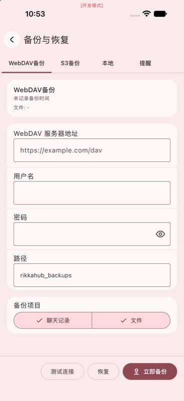
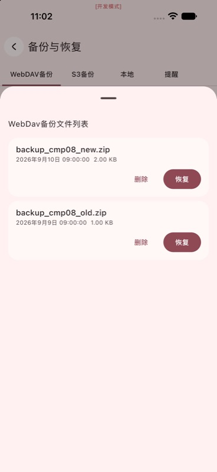
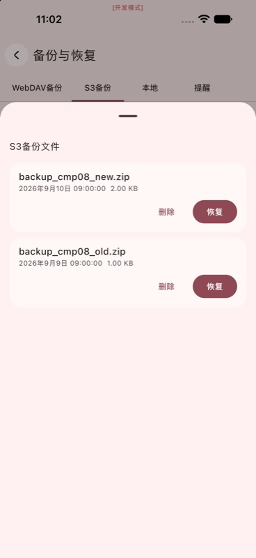
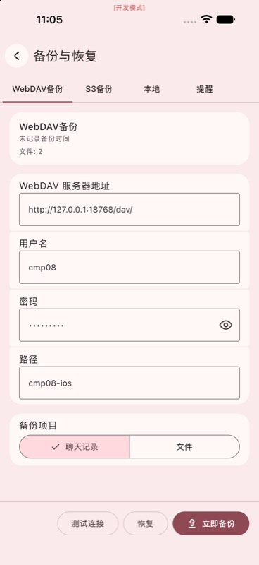
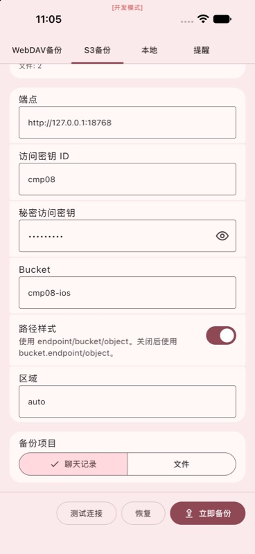

# 第 08 项 iOS GUI：Max 验证通过

日期：2026-09-10。父任务已核对本轮为 `gpt-5.6-terra / high`。

## 范围与目标

唯一操作目标为 iPhone 17 Pro Max，UDID
`03C090DA-107B-4F9F-BCCD-8D5265D32820`。XcodeBuildMCP 临时 profile
`cmp08-ios-max` 明确绑定该 UDID 和 bundle `me.rerere.rikkahub.ios`；没有访问旧 Pro 或其他设备。
复用已构建的 `RikkaHub.app`，没有重新构建。对应 `RikkaHub.debug.dylib` SHA-256 为
`37df8a167aaba207d30a2f850e8a76a65201fdb6ca90fb5a5b08d81b9deaa5d9`。

父任务先用本机测试夹具准备两组假配置，并确认仅替换 `webdav_config`、`s3_config`，
其余 preference 值和未知字段保持一致；此准备不计为 GUI 验证。文本输入工具此前未能证明空字段写入，
本项不把文本输入作为覆盖范围；相关设置更新已有代码测试覆盖。

早期输入尝试的截图仅作工具限制证据，不能作为功能通过依据：

## 实际 GUI 验证

从冷启动应用经设置 → 数据备份 → 备份与恢复进入页面，四个标签 WebDAV、S3、本地、提醒均可切换。
WebDAV 实际显示本机假 URL、用户 `cmp08`、路径 `cmp08-ios`；S3 实际显示本机假 endpoint、
access key、bucket `cmp08-ios`、region `auto` 和开启的路径样式。秘密字段只以掩码显示。

WebDAV 与 S3 分别点击 Test Connection，均显示“连接成功”。各自点击页面顶层 Restore 后，只检查打开的列表，
没有触碰任一条目的删除或恢复按钮；两次均仅显示下列降序 ZIP 文件：

1. `backup_cmp08_new.zip`，2026-09-10 09:00:00，2.00 KB；
2. `backup_cmp08_old.zip`，2026-09-09 09:00:00，1.00 KB。

没有显示目录或 `ignore.txt` 等文本项。

随后通过真实 GUI 分别取消 WebDAV 与 S3 的“文件”备份复选项，同时保留“聊天记录”勾选；切换四个标签后，
完整停止应用并在同一数据上冷启动。重新进入页面后，两协议的夹具配置与上述“聊天记录选中、文件未选中”状态
均保持，且分别再次打开顶层 Restore 列表，仍得到同样两项。最后再次在 GUI 中勾选两协议的“文件”项，
切换标签核对，再停止应用。父任务随后从实际磁盘确认两组 items 均已恢复为 `[DATABASE, FILES]`。
本轮未单独确认同进程离开备份页再进入；重新进入页面的持久化证据来自完整冷启动。

上述四张截图均已用 `view_image` 核对；其 SHA-256 分别为：

| 证据 | SHA-256 |
|---|---|
| `gui-ios-max-webdav-list.png` | `310b030f698c6b5e3ac7a64510c5977daf8fa4e3079e4ac5bbff3197f0594b2e` |
| `gui-ios-max-s3-list.png` | `8e05b43f84b4bafb2395009ff5a835134702182e0998d71fac06fb4ac8d1646c` |
| `gui-ios-max-cold-webdav-option.png` | `d736d44ff35bcf58dd3fd961b4670f6c2e31f948fef024a1184b376201b6d913` |
| `gui-ios-max-cold-s3-option.png` | `1282c129391b679d939b0011c99e2d95640ff2ea17b55fd136a1b99f79314b71` |

## 限制与清理

GUI 子 agent 没有执行立即备份、列表项恢复、删除、上传、卸载、清空数据、钥匙串访问、真实模型请求或直接读写
preferences/DB。父任务已在 03:05:32Z 独立只读核对 GUI 取消“文件”项后的两组 items 都为
`[DATABASE]`，其他配置字段不变；随后在应用停止后精确恢复 Max 的两组原空配置，其余 44 项和未知
protobuf 字段不变。原配置副本已删除。本轮没有直接写入这些偏好；工具实际返回值和文件指纹见
[主验证记录](verification.md)。

旧 iPhone 17 Pro 的虚假 WebDAV 字段已由父 agent 按
[旧 Pro 清理记录](ios-pro-cleanup.md) 安全恢复：protobuf builder 仅修改 `webdav_config`，
其余 45 项和未知字段均相等。旧 Pro 清理不计为本项 GUI 验证。

本轮已停止 Max 应用，保持模拟器与数据；不持久化 XcodeBuildMCP profile 和临时截图源文件均已清理。
没有改动源码、项目设置、Xcode 用户文件或提交。
