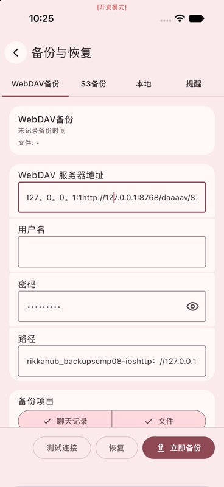

# 旧 iPhone 17 Pro 测试字段清理

2026-09-10。设备：`469B364C-382C-4068-A012-3CD026296BAE`。
用户已改用 iPhone 17 Pro Max 完成本轮 GUI；本记录只描述旧设备的测试数据清理，**不计为 GUI 验证通过**。

Pro 上先前的自动输入产生全角标点和追加文本；已知测试前 WebDAV URL、用户名、密码均为空，
路径为 `rikkahub_backups`，两个备份选项均勾选。S3 未修改。
应用已停止，未卸载或重置应用/模拟器。

以下为清理前的历史输入问题截图，并非清理后的状态：

清理步骤、预期与实际结果：

1. 通过 `simctl get_app_container` 精确定位旧 Pro 的应用数据目录，以本项目已有的
   DataStore 1.2.1 `PreferencesProto` 读取 `settings.preferences_pb`。读取结果仅在进程内检查，未输出整份设置。
2. 将 `webdav_config` 的所有字段与此前记录的虚假测试状态逐项比较，包含乱码 URL/path、空用户名、
   `test-only` 假密码和原备份选项。预期完全一致，否则不写入；实际完全一致。
3. 再次核对文件 SHA-256 与检查时相同，并确认旧 Pro 应用未运行。
   只恢复 URL/用户名/密码为空、path 为原值，保留 items；通过原 protobuf builder 保留其他内容，原子替换文件。
4. 写入前后比较：除 `webdav_config` 外其余 **45 项 preference 值和未知 protobuf 字段全部相等**，
   key 数量不变，WebDAV Value 的其他 protobuf 字段不变；序列化与磁盘回读均完全一致。
5. 保存预期假值的临时校验文件已删除。没有创建整份用户设置的转储或备份，没有读取钥匙串。

| 文件指纹 | SHA-256 |
|---|---|
| 清理前 | `2f7b6e585bf541b93b1e2604514de37e7b4ad6c313a6d38b3aaaf3b844e51815` |
| 清理后 | `240e5543a8735a80e0ccf0f092e01dccd09e2a8cefe249f44000e7f9eb00bf4b` |

此处程序清理仅撤销本轮已确认的测试字段；Pro Max 的 GUI 配置、请求、列表、重入及冷启动须另行实际操作验证。
