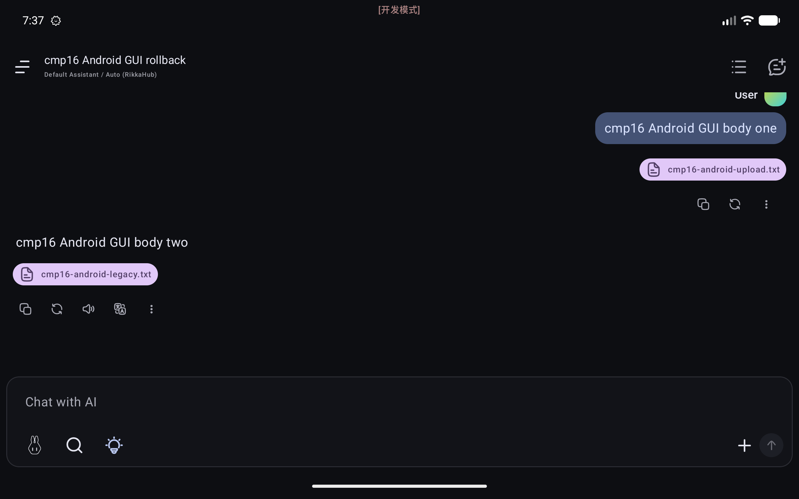

# CMP rollback 16 — Android GUI verification

Device: `Pixel_10_Pro_XL` (`emulator-5554`), with its existing 2560×1600 override retained.
The final ARM64 debug APK digest matched the recorded build artifact before testing.

## Remote backup and restore

Both WebDAV and S3 were preconfigured while the app was stopped, then exercised through the app GUI.  Each protocol passed its GUI connection test, created one full backup, and showed one item in its remote restore list.

| Check | WebDAV | S3 |
| --- | --- | --- |
| Full archive entry count | 6 | 6 |
| Database triplet present | true | true |
| GUI conversation delete and absence | true | true |
| GUI restore and original restart prompt | true | true |
| Restored message bodies | 2 | 2 |
| Restored attachment digest match | true | true |
| Backup-time visible settings round trip | n/a | true |
| Parent independent archive check | [saved result](webdav-parent-archive-check.json) | [saved result](s3-parent-archive-check.json) |
| GUI remote delete after parent approval | true | true |

The private ZIP copies were retained before remote deletion, independently checked by the parent agent, and then deleted together with the remaining private test artifacts.

For S3, the archive-backed visible setting was **Dynamic Color**: its backup value was enabled, it was changed to disabled after the backup, and the restored UI showed it enabled again after the original restart.  WebDAV has no covered visible-settings assertion: its initially chosen Color Mode marker is stored outside the archived settings store and was therefore excluded from this assertion.

Only synthetic fixture data is visible in this restored-state screenshot:

## Local FileKit picker import

The Local page's **Import from File** entry opened Android DocumentsUI.  The selected source was a one-entry ZIP containing only the synthetic upload marker: no database or settings entry was present.  Its imported marker digest matched the private expected record, the source ZIP remained present, `restore_*` temporary-file count was `0`, and the app showed and used its original restart prompt.

## Cleanup

After the GUI work, the app was stopped and its test profile was restored from `freshbaseline`.  The post-restore manifest has 41 files and is byte-for-byte identical to the pre-test per-file SHA-256 manifest (`freshbaseline_manifest_match=true`).

The machine-readable completion checks are in [cleanup-evidence.json](cleanup-evidence.json).  It contains counts, booleans, and the synthetic marker digest only.
